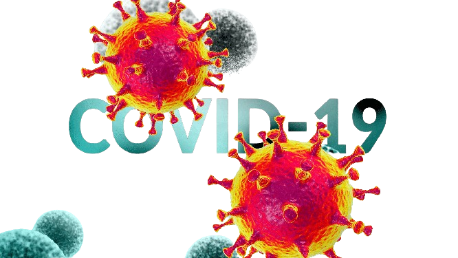
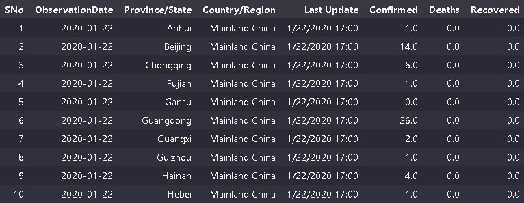
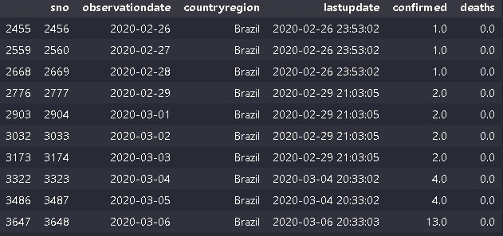
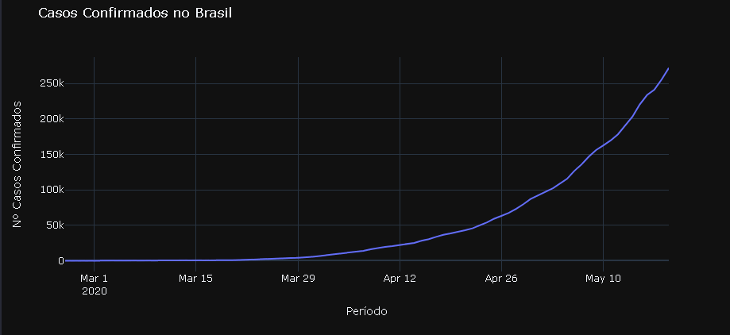
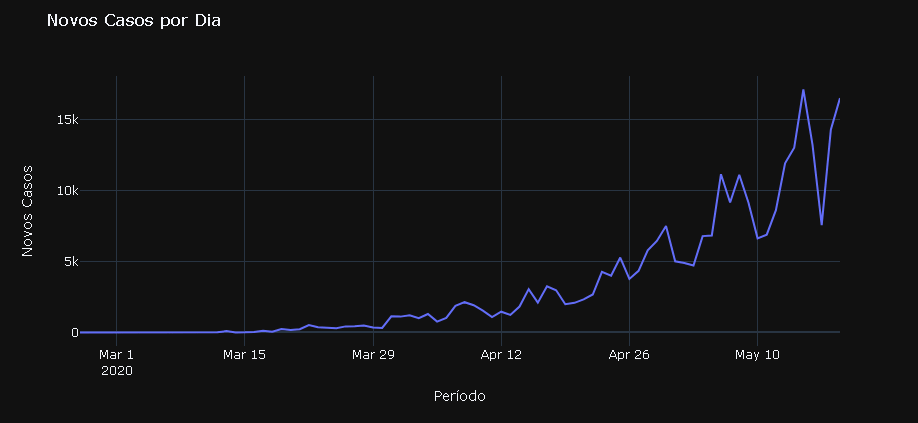
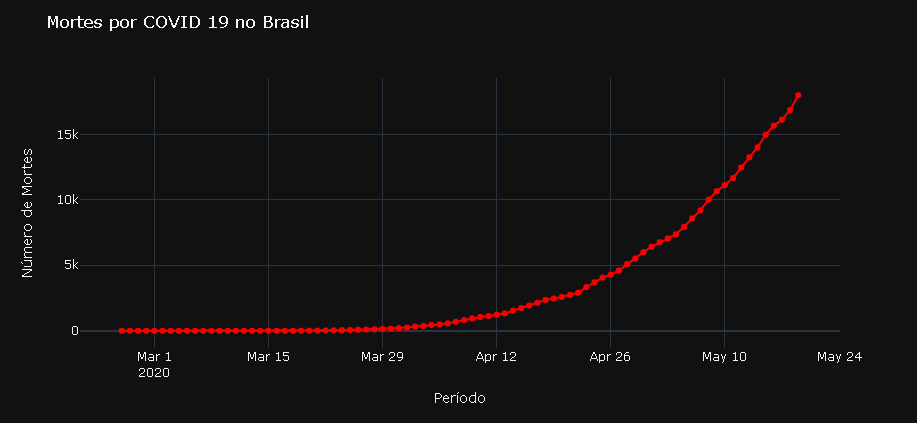
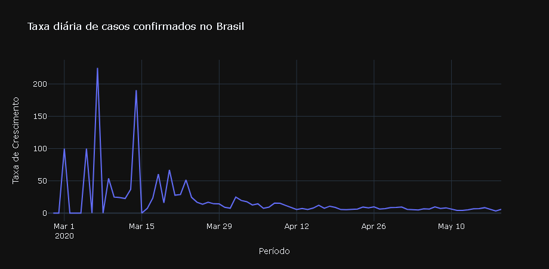
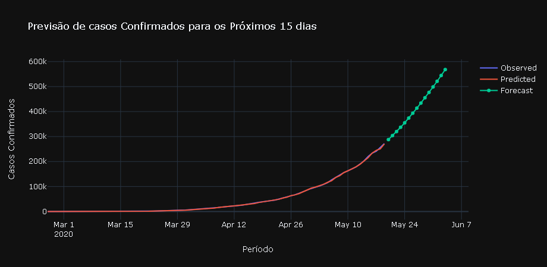
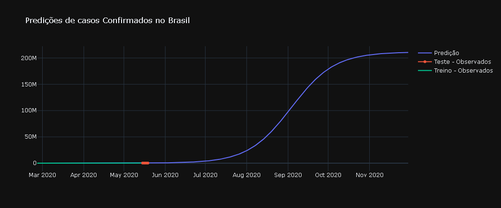

<h1>Desafio de Projeto:  Ciência de Dados com Python </h1>

 

#   Criando Modelos de Previsão para Analisar a Evolução do COVID-19 no Brasil 👨‍⚕️📈

## Entendendo o desafio
A pandemia do COVID-19 teve um impacto significativo em todo o mundo, incluindo no Brasil. A capacidade de prever a evolução da doença é crucial para a implementação de medidas preventivas e alocar recursos de forma eficiente.

 

<strong>Definição do Objetivo: </strong>Você é um cientista de dados contratado para um projeto de Machine Learning com o objetivo de criar um modelo de previsão utilizando Python para analisar e estimar a evolução da COVID-19 no Brasil. O intuito é fornecer insights valiosos sobre possíveis tendências futuras dos casos de COVID 19 no Brasil com base nos dados históricos disponíveis.

### Linguagem Utilizada:

### Principais Bibliotecas Utilizadas:

#### Fundamentos Utilizados:

- Estruturas Lógicas, Condicionais e de Repetição;
- Variáveis e Tipos de Dados;
- Visualização de dados;
- Funções e Docstrings;
- Machine Learning.

 

## Etapas do Desafio:

1. <strong>Coleta e Preparação dos Dados:</strong>
    
     
    
    - <strong>Dados Disponíveis: </strong>Os dados necessários para este projeto podem ser obtidos a partir de fontes confiáveis, como órgãos de saúde pública, instituições governamentais ou repositórios online. A coleta dos dados utilizados neste projeto foi realizado de um arquivo CSV baixado na plataforma de competições Kaggle, disponível em: https://www.kaggle.com/datasets/sudalairajkumar/novel-corona-virus-2019-dataset

      

    <h5 align = "center"> 
    
    
  <strong>Imagem:</strong> Amostra da base dados.

    </h5>
    
     

    
    - <strong>Pré-Processamento: </strong>Após a importação da base de dados foi necessário garantir que  as informações estivessem prontas para a análise e livres de ruídos, inconsistências e redundâncias, visando a qualidade dos dados a serem analisados. Com isso, foi necessário conferir se os tipos de dados estavam corretos, assegurar que os nomes das colunas estivessem sem caracteres especiais e letras maiúsculas, filtrados por país, neste caso o Brasil e excluir da análise colunas desnecessárias para a finalidade do projeto. 

    <h5 align = "center"> 
        
        
  <strong>Imagem:</strong> Amostra dos dados tratados.

    </h5>

     ##### Observação: Os dados do país não apresentam informações a nível de estado e região, somente em nível nacional.   
     

2. <strong>Análise Exploratória dos Dados: </strong>Chegamos ao momento de realizar uma análise exploratória dos dados para compreender a distribuição dos casos, identificar padrões, sazonalidades e examinar se há correlações entre diferentes variáveis.
    
    - <strong>Casos Confirmados: </strong> Podemos constatar a evolução dos casos confirmados no Brasil ao longo do tempo, que apresentaram uma taxa média de crescimento de 16,27% no período avaliado, dando-se inicio dos casos confirmados em 26/02/2020. Até o fim do período analisado, em 19/05/2020 foram confirmados 271,885 mil casos de COVID 19 no Brasil. 

    <h5 align = "center"> 
        
        
  <strong>Imagem:</strong> Evolução de Casos Confirmados.

    </h5>
        
     

    - <strong>Número de Casos por Dia: </strong> Na análise anterior foi possível visualizar o crescimento exponencial de casos apartir de Abril de 2020, contudo, o número de casos por dia apresenta uma visão um pouco mais preocupante e os picos de novos casos da doença acompanhada de uma taxa média de crescimento diário de 19.35%.
    
    <h5 align = "center"> 
        
        
  <strong>Imagem:</strong> Evolução de Novos Casos por Dia.

    </h5>
        
     

    - <strong>Número de Mortes: </strong> Agora, podemos visualizar o crescimento no número de mortes ao longo do tempo em circunstância da proliferação da doença. Como esperado, o crescimento no número de mortes acompanha aumento de casos confirmados da doença.
    
    <h5 align = "center"> 
        
        
  <strong>Imagem:</strong> Número de Mortes por COVID 19.

    </h5>

     

    - <strong>Taxa de Crescimento de Casos de COVID 19 no Brasil: </strong> É possível analisarmos que no período que se iniciou o proliferação da doença houve um crescimento percentual diário, exponencial de casos e que ao decorrer do período houve uma estabilização no valor percentual de casos,porém apresentando que o contágio da doença continua ao decorrer do período, atentando-nos para o momento em que ao apresentar uma taxa menor 0% o contágio começará a diminuir. 
    <h5 align = "center"> 
        
        
  <strong>Imagem:</strong> Taxa de Crescimento dos Casos de COVID 19.

    </h5>

     

3. <strong>Desenvolvimento do Modelo de Previsão: </strong> Construimos dois modelos de previsão para analisar a evolução de novos casos de COVID 19 e avaliar qual dos dois mais se adequa ao nosso estudo:

    -  <strong>Metódo ARIMA: </strong>Neste modelo de previsão realizamos uma análise de 15 dias. É possível visualizar que a apredizagem do modelo acompanha corretamente os dados observados da base e apresentando uma previsão de crescimento no número de casos confirmados no final do período a 568.125 casos de COVID 19.

    <h5 align = "center"> 
        
        
  <strong>Imagem:</strong> Predição de Casos de COVID 19 para os próximos 15 dias.

    </h5>

     

    -  <strong>Metódo Forecasting com Facebook Prophet: </strong> Neste modelo realizamos análise de um período maior, 200 dias, com um crescimento exponencial de casos e apresentando uma predição de 2.107.424 casos de COVID 19 no Brasil ao final do período.

    <h5 align = "center"> 
        
        
  <strong>Imagem:</strong> Predição de Casos de COVID 19 para os próximos 200 dias.

    </h5>

     

<strong>ATUALIZAÇÃO DO RESULTADO: </strong>No dia 03/06/2020 no final do período de análise foram registrados 584.562 casos de COVID 19  e no dia 30/11/2020 foram registrados 6.336.278 casos. Com isso, podemos afirmar que o modelo de previsão mais adequado ao nosso estudo é o Metódo ARIMA  apresentando uma acurácia de 97.18% do modelo de previsão.

#### Fontes:
- https://g1.globo.com/bemestar/coronavirus/noticia/2020/06/03/casos-de-coronavirus-e-numero-de-mortes-no-brasil-em-3-de-junho.ghtml
- https://g1.globo.com/bemestar/coronavirus/noticia/2020/11/30/casos-e-mortes-por-coronavirus-no-brasil-em-30-de-novembro-segundo-consorcio-de-veiculos-de-imprensa.ghtml
#
### Conclusão:

Este projeto conclui com êxito seu objetivo de desenvolver um modelo de previsão utilizando Python, oferecendo uma oportunidade valiosa para contribuir no entendimento da dinâmica da COVID-19 no Brasil e podendo ser adaptado e aprimorado com o tempo, incorporando novos dados e métodos de modelagem conforme necessário, visando garantir que a interpretação e comunicação dos resultados sejam feitas de maneira ética, evitando alarmismo e promovendo a conscientização sobre a importância das medidas preventivas com base em dados.
#

### Códigos:

       

#
### Contato:

    
  

